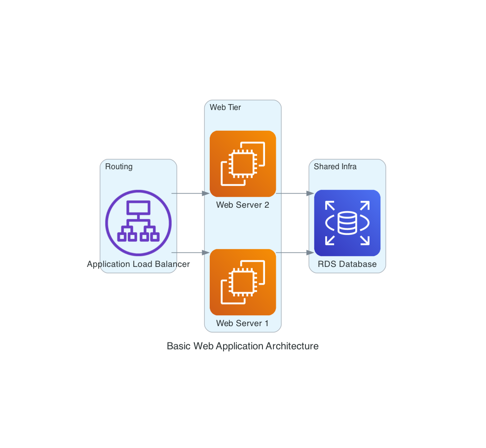
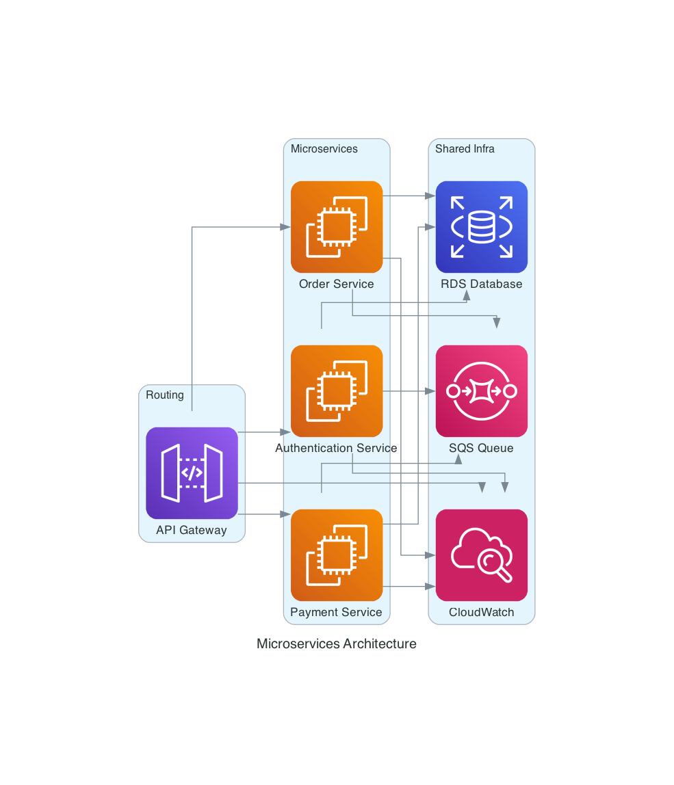

# AI Engineer Home Assignment - Enhanced Diagram Service

An async FastAPI service with AI-powered diagram generation capabilities using Google's Gemini API and the Python diagrams library

## 🚀 Features

- **AI-Powered Diagram Generation**: Uses Google Gemini API to generate cloud architecture diagrams from natural language descriptions
- **Async FastAPI Service**: High-performance async web service with automatic OpenAPI documentation
- **Multiple Endpoints**: Text processing, external API calls, diagram generation, and assistant-style interactions
- **Docker Support**: Containerized deployment with Docker and Docker Compose
- **MCP Integration**: Uses Model Context Protocol for structured tool interactions
- **Comprehensive Testing**: Full test coverage with multiple test categories
- **Automatic Cleanup**: Temporary files are automatically cleaned up after diagram rendering

## 📋 Prerequisites

- Python 3.11+
- Docker (optional, for containerized deployment)
- Google Gemini API key (required for diagram generation)
- Graphviz system package (for diagram rendering)

## 🛠️ Installation

### System Dependencies

First, install Graphviz:

```bash
# macOS
brew install graphviz

# Ubuntu/Debian
sudo apt-get install graphviz

# Windows (using Chocolatey)
choco install graphviz
```

### Python Dependencies

1. **Clone the repository**
   ```bash
   git clone <repository-url>
   cd home_assignment_ai_engineer
   ```

2. **Install dependencies using UV (recommended)**
   ```bash
   # Install UV if not already installed
   pip install uv
   
   # Install project dependencies
   uv pip install -e .
   
   # Install development dependencies
   uv pip install -e .[dev]
   ```

   Or with pip:
   ```bash
   pip install -e .
   pip install -e .[dev]
   ```

3. **Set up environment variables**
   ```bash
   # Copy the example environment file
   cp .env.example .env
   
   # Edit .env and add your Gemini API key
   export GEMINI_API_KEY=your_gemini_api_key_here
   ```

## 🔧 Configuration

### Environment Variables

| Variable         | Required | Default   | Description                                           |
|------------------|----------|-----------|-------------------------------------------------------|
| `GEMINI_API_KEY` | Yes      | -         | Google Gemini API key for diagram generation          |
| `HOST`           | No       | `0.0.0.0` | Server host address                                   |
| `PORT`           | No       | `8000`    | Server port                                           |
| `LOG_LEVEL`      | No       | `INFO`    | Logging level (DEBUG, INFO, WARNING, ERROR, CRITICAL) |

### Getting a Gemini API Key

1. Visit [Google AI Studio](https://ai.google.dev/)
2. Sign in with your Google account
3. Create a new API key
4. Copy the key and set it as `GEMINI_API_KEY` in your environment

## 🚀 Running the Service

### Local Development

```bash
# Option 1: Using uvicorn directly
uvicorn diagram_generator.api.app:app --reload --host 0.0.0.0 --port 8000

# Option 2: Using the Docker setup
docker-compose up --build
```

### Docker Deployment

```bash
# Set your API key in the environment
export GEMINI_API_KEY=your_gemini_api_key_here

# Build and run with Docker Compose
docker-compose up --build

# Or build Docker image manually
docker build -t ai-diagram-service .
docker run -p 8000:8000 -e GEMINI_API_KEY=your_key ai-diagram-service
```

## 🧪 Testing

The project includes comprehensive tests covering all components:

### Test Structure

```
tests/
├── api/            # API endpoint tests
│   ├── routes/     # Route-specific tests
│   └── models/     # Request/response model tests
├── agents/         # Diagram agent tests
├── tools/          # MCP tool tests
├── core/           # Core module tests
├── utils/          # Utility function tests
└── conftest.py     # Test configuration
```

### Running Tests

Use the test runner for different test scenarios:

```bash
# Run all tests
python run_tests.py all

# Run specific test categories
python run_tests.py api      # API tests only
python run_tests.py agents   # Agent tests only
python run_tests.py tools    # Tool tests only
python run_tests.py utils    # Utility tests only
python run_tests.py core     # Core module tests only

# Run tests with coverage report
python run_tests.py coverage

# Run only failed tests
python run_tests.py failed

# Quick smoke test
python run_tests.py check

# Fast test run (no verbose output)
python run_tests.py fast
```

### Test Categories

- **Unit Tests**: Test individual functions and classes
- **Integration Tests**: Test component interactions
- **API Tests**: Test HTTP endpoints and responses
- **Agent Tests**: Test AI diagram generation logic
- **Tool Tests**: Test MCP tool implementations

### Test Coverage

Generate a coverage report:

```bash
python run_tests.py coverage
```

Coverage report will be available in `htmlcov/index.html`

## 📡 API Endpoints

### Core Endpoints

- `GET /health` - Health check with service status and version information
- `GET /docs` - Interactive API documentation (Swagger UI)
- `GET /redoc` - Alternative API documentation

### Diagram Generation

- `POST /generate-diagram` - Generate architecture diagrams from natural language descriptions

## 📊 Usage Examples

### 1. Health Check

```bash
curl http://localhost:8000/health
```

**Response:**
```json
{
  "status": "healthy",
  "service": "AI Engineer Home Assignment - Enhanced Diagram Service",
  "version": "1.0.0",
  "diagram_service_available": true
}
```

### 2. Generate Architecture Diagram

```bash
curl -X POST "http://localhost:8000/generate-diagram" \
  -F "description=A web application with load balancer, two web servers, and a database"
```

**Response:**
Returns a PNG image directly (binary data)

**Example Usage:**
```bash
# Save the diagram to a file
curl -X POST "http://localhost:8000/generate-diagram" \
  -F "description=Create a diagram showing a basic web application with an Application Load Balancer, two EC2 instances for the web servers, and an RDS database for storage. The web servers should be in a cluster named 'Web Tier'." \
  -o web-app-diagram.png

# Or view in browser
curl -X POST "http://localhost:8000/generate-diagram" \
  -F "description=Design a microservices architecture with three services: an authentication service, a payment service, and an order service. Include an API Gateway for routing, an SQS queue for message passing between services, and a shared RDS database. Group the services in a cluster called 'Microservices'. Add CloudWatch for monitoring." \
  -o serverless-diagram.png
```

**Generated Diagram Examples:**




## 🏗️ Architecture Overview

### System Components

1. **FastAPI Application** (`diagram_generator/api/app.py`): Main web service with async endpoints
2. **Diagram Agent** (`diagram_generator/agents/diagram_agent.py`): AI-powered diagram generation using Gemini API
3. **MCP Server** (`diagram_generator/tools/mcp_server.py`): Model Context Protocol server for tool interactions
4. **MCP Tools** (`diagram_generator/tools/mcp_tools.py`): Tool implementations for diagram generation

### Supported Diagram Components

The service supports generating various cloud architecture diagrams with these components:

- **Compute**: EC2, ECS, Lambda, EKS
- **Database**: RDS, DynamoDB, ElastiCache, Aurora
- **Network**: ALB, NLB, CloudFront, Route53, VPC
- **Storage**: S3, EBS, EFS
- **Security**: IAM, KMS, Secrets Manager
- **Monitoring**: CloudWatch, X-Ray
- **API**: API Gateway, AppSync

### Data Flow

1. User sends natural language description
2. Gemini API analyzes requirements and generates tool calls
3. MCP server executes diagram creation tools
4. Diagram is rendered to PNG and returned
5. Temporary files are automatically cleaned up

## 📄 File Management

The service automatically manages temporary files:

- Diagram images are stored in a temporary directory
- Files are cleaned up after diagram rendering
- No manual cleanup required
- Restart the service to clear any remaining temporary files
